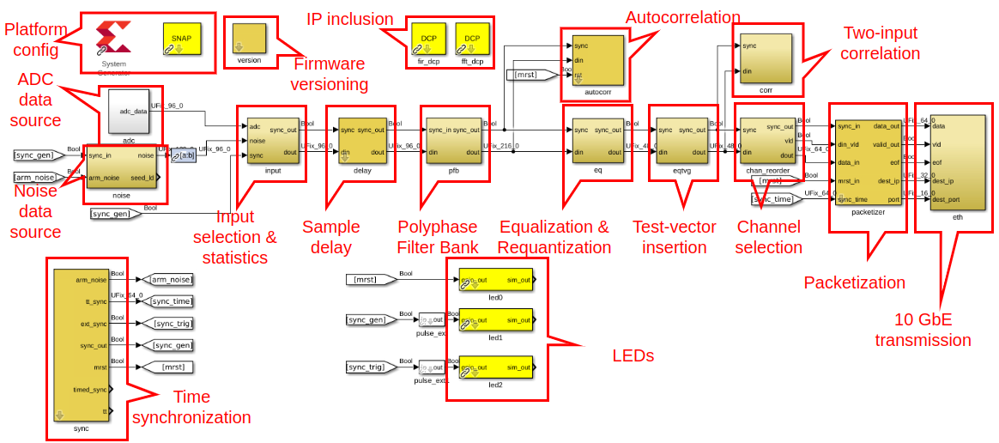

F-Engine System Overview
========================

Overview
--------

The CASM F-Engine firmware is designed to run on a SNAP [1]_ FPGA board, and provides channelization of 12 analog data streams, sampled at up to 250 Msps, into 4096 sub-bands.

After channelization, data words are requantized to 4-bit resolution (4-bit real + 4-bit imaginary) and a subset of the 4096 generated frequency channels are output as a UDP/IP stream over a single 40 Gb/s Ethernet interface.

The top-level specs of the F-Engine are:

+-------------------------+----------+----------------------+
| Parameter               | Value    | Notes                |
+=========================+==========+======================+
| Number of analog inputs | 12       |                      |
|                         |          |                      |
+-------------------------+----------+----------------------+
| Maximum sampling rate   | 250 Msps | Limited by ADC speed |
|                         |          | & timing constraint  |
|                         |          | target               |
+-------------------------+----------+----------------------+
| Test inputs             | Noise;   | Firmware contains 2  |
|                         | zeros    | independent gaussian |
|                         |          | noise generators.    |
|                         |          | Any of the 12 data   |
|                         |          | streams may be       |
|                         |          | replaced with any of |
|                         |          | these digital noise  |
|                         |          | sources, or zeros.   |
+-------------------------+----------+----------------------+
| Delay compensation      | <=7      | Programmable per-    |
|                         | samples  | input between 0 and  |
|                         |          | 7 samples. Mostly    |
|                         |          | useful for testing   |
+-------------------------+----------+----------------------+
| Polyphase Filter Bank   | 4096     |                      |
| Channels                |          |                      |
+-------------------------+----------+----------------------+
| Polyphase Filter Bank   | Hamming; |                      |
| Window                  | 4-tap    |                      |
+-------------------------+----------+----------------------+
| Polyphase Filter Bank   | 8 bits   |                      |
| Input Bitwidth          |          |                      |
+-------------------------+----------+----------------------+
| FFT Coefficient Width   | 18 bits  |                      |
+-------------------------+----------+----------------------+
| FFT Data Path Width     | 18 bits  |                      |
+-------------------------+----------+----------------------+
| Post-FFT Scaling        | 16       |                      |
| Coefficient Width       |          |                      |
+-------------------------+----------+----------------------+
| Post-FFT Scaling        | 4        |                      |
| Coefficient Binary      |          |                      |
| Point                   |          |                      |
+-------------------------+----------+----------------------+
| Number of Post-FFT      | 256      | One coefficient per  |
| Scaling Coefficients    |          | analog input. One    |
|                         |          | coefficient per 16   |
|                         |          | frequency channels   |
+-------------------------+----------+----------------------+
| Post-Quantization Data  | 4        | 4-bit real; 4-bit    |
| Bitwidth                |          | imaginary            |
+-------------------------+----------+----------------------+
| Frequency Channels      | <=3072   | Runtime              |
| Output                  |          | programmable.        |
|                         |          | Maximum is set by    |
|                         |          | total data rate      |
|                         |          | which is limited to  |
|                         |          | 10Gb/s (including    |
|                         |          | protocol overhead).  |
|                         |          | 3072 channels =      |
|                         |          | approx 9Gb/s         |
|                         |          | + overhead           |
+-------------------------+----------+----------------------+

A block diagram of the F-engine -- which is also the top-level of the Simulink source code for the firmware -- is shown in :numref:`feng_firmware_top`.

    F-Engine top-level Simulink diagram.

Block Descriptions
++++++++++++++++++

Each block in the firmware design can be controlled using an API described in :numref:`control-interface`. Here the basic functionality of each block is described.

Platform Config (`XSG`)
~~~~~~~~~~~~~~~~~~~~~~~

The platform configuration block -- often called the MSSGE or XSG config block by CASPER collaborators -- defines the high-level parameters of the firmware design.
The CASM firmware is configured to target the SNAP1 FPGA board, with the DSP chain clocking synchronously from the ADC clock at the sample rate of 250 MS/s.

Firmware Versioning (`version`)
~~~~~~~~~~~~~~~~~~~~~~~~~~~~~~~

The `version` block in the Simulink design contains information about the firmware which can be read at runtime.
This information includes a user-defined version number (formatted as `major`.`minor`.`revision`.`bugfix`) as well as the firmware build time.
The `version` block is used by the control software to detect mismatches between software and firmware versions.

ADC Data Source (`adc`)
~~~~~~~~~~~~~~~~~~~~~~~

The ADC data source block -- `adc` in the Simulink diagram -- encapsulates an underlying interface to the SNAP ADCs.
It is configured to operate the SNAP ADCs in 12-channel mode, with each channel sampled at 250 MS/s
This block is the source of 8-bit ADC samples (presented as a parallel 96-bit bus of 12-ADC channels) which feed the CASM DSP pipeline.

Noise Data Source (`noise`)
~~~~~~~~~~~~~~~~~~~~~~~~~~~

The Noise data source block -- `noise` in the Simulink diagram -- implements a pair of independent white gaussian noise generators.
Each noise generator can be seeded with a user-supplied value, and generates a pair of uncorrelated noise streams.
The `noise` block outputs a stream of 12 parallel data channels, designed such that they have the same format as the 12 ADC channels produced by the `adc` block.
Each channel may be populated with data from any one of the 4 internally generated noise streams.

Input Selection & Statistics (`input`)
~~~~~~~~~~~~~~~~~~~~~~~~~~~~~~~~~~~~~~

The input selection and statistics block -- `input` in the Simulink diagram -- provides two key functions.
First, the block accepts as input both noise and ADC inputs, and can switch between these on a per-ADC-channel basis so that the downstream pipeline processes either real, or simulated data.
The block can also replace any ADC data stream with a constant zero value, which may be useful for testing.
Second, the block provides bit statistics of the selected data streams.
Statistics include firmware-calculated mean, variance, and RMS.
A histogram of samples and snapshot of a small burst of samples is also provided.

Sample Delay (`delay`)
~~~~~~~~~~~~~~~~~~~~~~

The `delay` block allows runtime-configurable per-channel delays of up to 8 ADC samples to be inserted into the ADC data streams.
While these small delays are unlikely to be useful for cable-delay correction, they can be useful in testing.
For example, in conjuction with the `noise` block, the firmware can be used to simulate two ADC channels having identical, but time-delayed, data streams.

Polphase Filter Bank (`pfb`)
~~~~~~~~~~~~~~~~~~~~~~~~~~~~

The `pfb` block contains a 4-tap, 4096 channel PFB-based channelizer.
To speed compilation, this block is built with pre-compiled IP, included in the design via the `fir_dcp` and `fft_dcp` blocks.
The output of the `pfb` block is a stream of 18+18 bit complex-integer data for each ADC data.
Data are interpretted with 17 bits to the right of the binary point -- i.e., values are between +/-1.
A full 4096-channel spectrum is presented over 4096 clock cycles for the 6 even-numbered ADC channels in parallel.
The following 4096 clock cycles carry spectra from the odd-numbered ADC channels.

Autocorrelation (`autocorr`)
~~~~~~~~~~~~~~~~~~~~~~~~~~~~

The `autocorr` block provides the ability to read an accumulated autocorrelation spectrum for any of the ADC inputs.
The accumulation length is runtime-programmable, and results are integrated with floating point precision.

Equalization & Requantization (`eq`)
~~~~~~~~~~~~~~~~~~~~~~~~~~~~~~~~~~~~

The `eq` block multiplies each 18+18-bit complex number by a programmable 16-bit unsigned coefficient.
Coefficients are interpreted with 5 bits to the right of the binary point -- i.e. the maximum coefficient is 2048, and the coefficient precision is 0.03125.
After multiplying data, the resulting values are quantized (with a round-to-even and symmetric saturation scheme) to 4-bit precision.
4-bit values are interpretted with 3 bits to the right of the binary point -- i.e., values are between +/-0.875.
Spectra from individual ADC channels are multiplied by independent coefficient sets.
Each coefficient in a set is applied to 8 consecutive frequency channels -- i.e., 512 independent coefficients may be provided per ADC channel.

Test-vector Insertion (`eqtvg`)
~~~~~~~~~~~~~~~~~~~~~~~~~~~~~~~

The `eqtvg` block allows the channelized data streams to be replaced with a runtime-programmable test value.
Independent values may be provided for each ADC channel and for each frequency channel.
Values are repeated with each consecutive spectrum.
This functionality is particularly useful for testing downstream channel selection and transmission logic.

Two-Input Correlation (`corr`)
~~~~~~~~~~~~~~~~~~~~~~~~~~~~~~

The `corr` block implements a 2 input correlator.
Each input may be selected from any of the 12 ADC inputs, and the resultant correlation is computed and accumulated with a runtime-programmable integration time.
The `corr` block can be used with the `noise` and `delay` blocks to verify that the PFB is operating correctly, by correlation identical time-delayed copies of the same noise stream.
The `corr` block can also be used with the `autocorr` block to compare signal autocorrelation power before and after equalization, which can aid in setting EQ coefficient levels.

Channel Selection (`chan_reorder`)
~~~~~~~~~~~~~~~~~~~~~~~~~~~~~~~~~~

The channel selection block, `chan_reorder` provides a runtime-programmable frequency channel reorder, with the end result that 3/4 of the 4096 generated frequency channels are collected ready for packetization and UDP transmission.

Packetization (`packetizer`)
~~~~~~~~~~~~~~~~~~~~~~~~~~~~

The `packetizer` block inserts application packet headers in the channel down-selected data streams, and defines how large packets are, and to which IP addresses they are transmitted.
Each packet contains data from all 12 ADC channels, and any multiple of 8 frequency channels (though smaller packets incur more protocol overhead and the total data rate should be kept below 10 Gb/s).
The maximum packet size is 8192 kB.
Each packet contains a header describing
 - the timestamp of the sample in the packet
 - the channel index of the first channel in the packet
 - the ID of the SNAP board from which the packet is being sent

10 GbE Transmission (`eth`)
~~~~~~~~~~~~~~~~~~~~~~~~~~~

The `eth` block encapsulates a 10 Gb/s Ethernet interface.
This interface implements a UDP / IP / Ethernet stack.
Statistics are provided to determine data and packet transmission rates

Time syncronization (`sync`)
~~~~~~~~~~~~~~~~~~~~~~~~~~~~

The `sync` block locks the FPGA's timestamping logic to an externally provided Pulse-Per-Second (PPS) pulse, which is assumed to be locked to GPS time.

LEDs
~~~~

LEDs are provided to indicate the following events:

  1. LED0: Goes high when the board is in a reset condition. This happens prior to a synchronization event.
  2. LED1: Goes high for 2^26 clock cycles (approximately 268 ms for an ADC sample rate of 250 MS/s) immediately following a synchronization event.
  3. LED2: Goes high for 2^26 clock cycles (approximately 268 ms for an ADC sample rate of 250 MS/s) immediately following the arrival of a PPS pulse.

Initialization
++++++++++++++

The functionality of individual blocks is described below.
However, in order to simply get the firmware into a basic working state the following process should be followed:

  1. Program the FPGA
  2. Initialize all blocks in the system
  3. Trigger master reset and timing synchronization event.

In a multi-board system, the process of synchronizing a board can be relatively involved.
For testing purposes, using single board, a simple software reset can be used in place of a hardware timing signal to perform an artificial synchronization.
A software reset is automatically issued as part of system initialization.

The following commands bring the F-engine firmware into a functional state, suitable for testing.
See :numref:`control-interface` for a full software API description

.. code-block:: python

  # Import the SNAP F-Engine library
  from casm_f import snap_fengine

  # Instantiate a SnapFengine instance to a board with
  # hostname 'snap'
  f = snap_fengine.SnapFengine('snap')

  # Program a board
  f.program(path-to-fpg-file) # Load an fpg firmware binary

  # Initialize all the firmware blocks
  # and issue a global software reset
  f.initialize(read_only=False)

.. [1]
    See `the CASPER SNAP wiki page <https://casper.berkeley.edu/wiki/SNAP>`__

